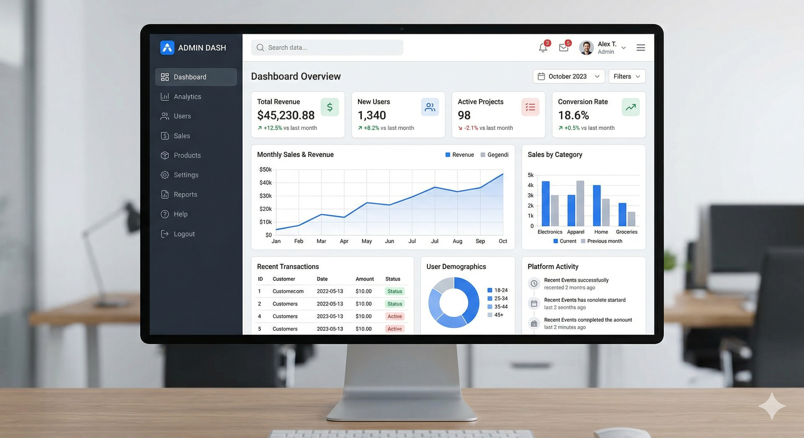

# Admin Dashboard Template

A production-shaped **React 19 + Vite 6 + TypeScript** admin dashboard starter. It ships with a full set of SaaS module pages, a themeable design system, role-aware navigation, and a mock API layer so it runs with zero backend dependencies — then drops cleanly onto a real API when you are ready.



## Features

- **11 module pages** wired through lazy routes and a protected shell: Overview, Analytics, Users, Team, Billing, Transactions, Notifications, Support, Integrations, Settings, plus Login and 404.
- **Multi-tenant foundation** — a `TenantProvider` scopes every request with an `X-Tenant-Id` header and persists the active workspace; the branded **ADMIN DASH** workspace switcher sits at the top of the left sidebar (and inside the mobile navigation dialog) so users can move between tenants.
- **Hardened session lifecycle** — access/refresh tokens, automatic `401 → refresh → retry` on the `http()` layer, and a silent refresh on load when the session has expired.
- **Internationalization** — `react-i18next` with `en` / `es` / `fr` bundles, selectable from User Settings; nav, shell, and key surfaces are translated through `t()`.
- **User settings** — a per-user personalization screen (`/app/settings/user`) holding the theme palette and interface language switches (also reachable from the avatar menu); preferences apply instantly and persist on the device.
- **Observability-ready** — a `monitoring` module reports errors/events to Sentry when `VITE_SENTRY_DSN` is set, and captures window errors/unhandled rejections; it is inert (console fallback) in the demo.
- **End-to-end tests** — a Playwright suite (`e2e/`) drives the running app (MSW-backed) across auth, routing, theming, tenancy, and language.
- **Themeable design system** with four presets (Core Light, Midnight Ops, Sunset Ember, Forest Deep) driven by CSS variables; selected from User Settings and persisted in `localStorage`.
- **Role-based access control** — nav items and protected routes are gated by the signed-in user's role (Owner / Admin / Manager) via a shared `canAccess` helper and `RoleRoute`.
- **Mock API via MSW** — the entire `/api/*` surface is served from in-browser mocking, with per-test reset. Swap in a real backend with a single env var (see [Going to production](#going-to-production)).
- **Resilient UI** — global + route-level error boundaries, skeleton screens that mirror final layouts (no spinner swaps or layout shift), retryable error panels on every module page, empty states with recovery actions, and centralized mutation error toasts.
- **Mistake-friendly flows** — destructive actions (team removal, API-key revoke) run through a confirm dialog with an **Undo** toast; the settings form shows inline validation, an unsaved-changes banner with discard, and pending-state buttons everywhere.
- **Command palette** — `⌘K` / `Ctrl+K` opens a `cmdk` palette for fuzzy page navigation, theme switching, and sign-out; the topbar search is its trigger. The notification bell is live (unread badge, mark-as-read, view-all).
- **Working controls** — no decorative buttons: role filter chips, roster/team/transaction CSV exports, invite-user flow, overview period selector, and chart-series filters are all wired to real state and mock endpoints.
- **Accessible (WCAG 2.2 AA)** — skip link, focus-visible rings, route announcements (`document.title` + `aria-live`) with focus moved to the page heading, keyboard-operable sortable/paginated tables, ≥44 px touch targets on mobile, sr-only chart data tables, AA-contrast tokens in every palette, `prefers-reduced-motion` support, `prefers-color-scheme` default theme, and jest-axe checks across key routes in CI.
- **Mobile-first continuity** — grouped scrollable mobile nav dialog, responsive roster cards vs. tables, safe-area insets, and a Playwright mobile viewport suite (`e2e/mobile.spec.ts`).
- **Accessible** — see the WCAG 2.2 AA bullet above; jest-axe runs in CI.
- **Tooling** — [Biome](https://biomejs.dev) (format + lint + import organization), Husky pre-commit, and a GitHub Actions CI pipeline (typecheck → biome → test → e2e → build).

## Tech stack

React 19 · TypeScript 5 (strict, project references) · Vite 6 · React Router v7 · TanStack Query v5 · Tailwind CSS v4 (CSS-first) · shadcn/ui (Radix) · React Hook Form + Zod · Recharts · MSW · i18next · Sentry (browser) · Biome · Vitest · Playwright.

## Quickstart

```bash
pnpm install      # install dependencies
pnpm dev          # start the Vite dev server (auto-starts the MSW worker)
pnpm build        # tsc -b (typecheck) + vite build -> dist/
pnpm preview      # serve the production build
pnpm test         # run the Vitest suite once
pnpm typecheck    # tsc -b (project-references typecheck)
pnpm lint         # biome check
pnpm format       # biome format --write .
pnpm e2e          # run the Playwright suite (boots pnpm dev automatically)
```

Requires Node 22+ and pnpm 11+.

## Project structure

```text
src/
├── app/            # AppProviders, AppRouter, AppShell, ErrorBoundary, QueryClient
├── components/
│   ├── ui/         # shadcn/ui primitives (button, card, dialog, ...)
│   ├── layout/     # AppShell, SidebarNav, Topbar, nav-items
│   ├── shared/     # PageHeader, SectionCard, DataTable (sortable/paginated), DetailDrawer, StatePanel (retryable), EmptyState, KpiCard, skeletons, ConfirmDialog, CommandPalette
│   ├── users/      # UsersTable, InviteUserDialog
│   └── settings/   # SettingsForm, AppearancePicker, LanguagePicker (user settings)
├── features/       # per-module context + data-access
│   ├── auth/       # AuthProvider, auth-api, protected-route
│   ├── tenants/    # TenantProvider, tenants-api (X-Tenant-Id scoping)
│   ├── i18n/       # i18n init, provider, locale switcher, locale bundles
│   ├── theme/      # ThemeProvider, theme-config
│   └── <module>/   # overview, users, settings, billing, analytics, team, ...
├── lib/            # http() fetch wrapper, cn(), rbac, notify, monitoring, download (CSV export)
├── mocks/          # MSW handlers, browser worker, seed data
├── pages/          # route components (one per module + login + not-found)
├── test/           # Vitest setup, node MSW server, renderApp, tests
├── types/          # shared domain types
└── styles.css      # Tailwind v4 entry + theme CSS variables
e2e/                # Playwright specs + helpers (auth, navigation, mobile)
```

Path alias: `@/` → `src/`. Always import via the alias.

## Theming

Themes are defined in `src/features/theme/theme-config.ts` and backed by CSS variable blocks in `src/styles.css` (`[data-theme="..."]`). Users pick a palette from **User Settings → Appearance** (`src/components/settings/appearance-picker.tsx`); the ⌘K command palette also lists palettes as quick shortcuts. To add a theme:

1. Add a variable set under `:root[data-theme="your-theme"]` in `styles.css`.
2. Register it in `themeDefinitions` with a `label`, `mode`, and three `preview` swatches.

With no stored preference the app follows `prefers-color-scheme` (dark → first dark theme). All text tokens are verified against WCAG AA contrast on every palette; keep that true when adding one.

## Role-based access control

- Add `roles?: AppRole[]` to a nav item in `src/components/layout/nav-items.ts` to restrict visibility.
- Wrap a protected route in `<RoleRoute roles={[...]}>` in `src/app/router.tsx` to redirect unauthorized roles to `/app/overview`.
- `canAccess(role, allowed)` (in `src/lib/rbac.ts`) is the single source of truth used by both the nav and the route guard.

> RBAC here is client-side and runs against the mock session. Enforcing real authorization still requires server-side checks when you connect a backend.

## Multi-tenancy

The app is built to serve multiple workspaces from one client.

- `TenantProvider` (`src/features/tenants/tenant-context.tsx`) holds the active tenant and persists it to `localStorage`.
- `src/lib/http.ts` attaches the active tenant as the `X-Tenant-Id` header on every request; changing the tenant invalidates all TanStack Query caches.
- The branded workspace switcher at the top of the left sidebar (**ADMIN DASH** logo + active tenant, `src/components/layout/workspace-switcher.tsx`) lets users move between tenants; on mobile it lives at the top of the navigation dialog, and it collapses to the logo mark when the sidebar is icon-only.
- Seed tenants live in `src/mocks/data.ts` (`tenantsPayload`); the mock API serves `/api/tenants`.

## Authentication & session

The client session model is deliberately production-shaped:

- `Session` carries `accessToken`, optional `refreshToken`, and `expiresAt` (`src/types/index.ts`).
- `src/lib/http.ts` sends `Authorization: Bearer <token>` and, on a `401`, calls `POST /api/auth/refresh` once and retries the original request; if refresh fails it invokes the registered `unauthorized` handler (redirect to `/login`).
- `AuthProvider` registers the HTTP auth handlers and silently refreshes an expired session on load (`src/features/auth/auth-context.tsx`).
- The mock login returns tokens; `POST /api/auth/refresh` issues a fresh access token.

## Internationalization

The UI ships translated through `react-i18next`:

- Locale bundles live in `src/features/i18n/locales/{en,es,fr}.json`; `en` mirrors the original English copy so existing behavior is preserved.
- `I18nProvider` is wired into the app and the test harness; the browser language detector persists the choice to `localStorage` (`admin-dashboard-template:lang`).
- Nav labels, group labels, the app shell, topbar, login CTA, and the overview header use `t()`.
- Users change language from **User Settings → Language** (`src/components/settings/language-picker.tsx`); it is also reachable from the avatar menu.
- Add a language: drop a new JSON bundle and register it in `supportedLanguages` (`src/features/i18n/i18n.ts`) — the User Settings picker renders it automatically.

## Observability

A small `monitoring` module (`src/lib/monitoring.ts`) provides a production-ready hook without forcing a dependency on the demo:

- Set `VITE_SENTRY_DSN` to lazily initialize `@sentry/browser` and report exceptions/events.
- With no DSN it falls back to `console.error` / `console.warn` (inert in the demo).
- Global `error` and `unhandledrejection` listeners forward to the reporter; caught render errors are reported from the route `ErrorBoundary`.
- Configure `VITE_APP_ENV` to tag the Sentry environment.

## End-to-end testing

`e2e/` holds a Playwright suite that runs against the live app (MSW stays active in dev):

- `playwright.config.ts` boots `pnpm dev` as the web server on `:5173`.
- `auth.spec.ts` exercises the mock sign-in flow; `navigation.spec.ts` covers routing, tenant switching, language switching, and theming; `mobile.spec.ts` runs a 390×844 viewport through grouped nav, roster cards, invite dialog, and the command palette.
- Run with `pnpm e2e` (or `pnpm e2e:ui` / `pnpm e2e:report`). CI installs Chromium and runs the suite.

## Going to production

The template is backend-free by default. To point it at a real API:

1. Copy `.env.example` to `.env` (or `.env.local`) and set `VITE_API_BASE_URL` to your API origin, e.g. `https://api.example.com`.
2. Ensure your backend exposes the same `/api/*` paths the MSW handlers use (see `src/mocks/handlers.ts`).
3. Build and deploy the static SPA (`pnpm build` → `dist/`). In a production build the MSW worker is not started, so requests go straight to your backend.
4. Replace the mock `AuthProvider`/session model with real credential handling and add server-side authorization — the client RBAC is a UI convenience only.

## Releases

- Commits follow [Conventional Commits](https://www.conventionalcommits.org/).
- Versioning and changelog are managed with [Commitizen](https://commitizen-tools.github.io/commitizen/): run `cz bump` to bump the version, tag it, and regenerate `CHANGELOG.md` from the conventional commits.
- CI publishes nothing; the release is created locally and pushed by the maintainer.

## Contributing

- Commits follow [Conventional Commits](https://www.conventionalcommits.org/).
- A Husky pre-commit hook runs `lint-staged` (Biome check + format) on changed files.
- PRs run the CI pipeline: typecheck, Biome, unit tests, E2E, and build.
- See `AGENTS.md` for the agent-oriented development conventions and `ARCHITECTURE.md` for the full architectural reference.
